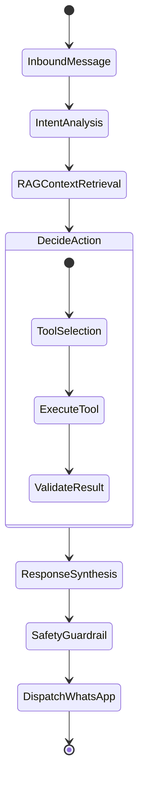

# AI Sales Agent & Tool Calling Architecture

## 1. Persona & Sales Philosophy

The AI Sales Agent acts as an expert digital sales representative. It is trained to:
- **Never hallucinate**: It never fabricates prices, stock counts, shipping durations, or discounts.
- **Always verify via tools**: If uncertain, it responds politely ("Let me check that for you right now") and invokes the corresponding database tool.
- **Drive conversions**: Recommends complementary items (cross-selling), suggests upgrades (upselling), and guides the customer through a step-by-step order confirmation process.

---

## 2. 12 Core Business Sales Tools

| Tool Name | Parameters | Description |
|---|---|---|
| `search_products` | `query: str, category: Optional[str], min_price: Optional[float], max_price: Optional[float], limit: int` | Searches catalog matching keywords, tags, budget constraints. |
| `get_product` | `product_id_or_sku: str` | Retrieves detailed specifications, attributes, and image gallery. |
| `check_inventory` | `product_id_or_sku: str, variant_id: Optional[str], size: Optional[str], color: Optional[str]` | Checks live in-stock quantity for exact variants. |
| `get_product_variants` | `product_id: str` | Fetches available colors, sizes, materials, and pricing differentials. |
| `get_order` | `order_number_or_id: str, customer_phone: Optional[str]` | Fetches order status, item breakdown, and delivery state. |
| `create_order` | `customer_name: str, customer_phone: str, delivery_address: str, items: List[OrderItemInput], payment_method: str, notes: Optional[str]` | Places a verified order and decreases inventory. |
| `update_order` | `order_id: str, status: Optional[str], notes: Optional[str]` | Modifies order state or notes. |
| `calculate_shipping` | `delivery_address: str, city: str, item_count: int` | Calculates exact shipping rate based on location & weight. |
| `get_shipping_status` | `order_id_or_tracking: str` | Retrieves live courier tracking details. |
| `capture_lead` | `name: str, phone: str, intent: str, interested_products: List[str], budget: Optional[float], location: Optional[str], lead_score: int` | Enrolls customer as an active CRM lead with scoring. |
| `create_support_ticket` | `customer_phone: str, subject: str, issue_description: str, priority: str` | Opens a support issue for operational follow-up. |
| `transfer_to_human` | `reason: str, conversation_id: str, department: Optional[str]` | Escalates conversation to human inbox and sets state to `HUMAN_REQUIRED`. |

---

## 3. LangGraph Orchestration Flow

