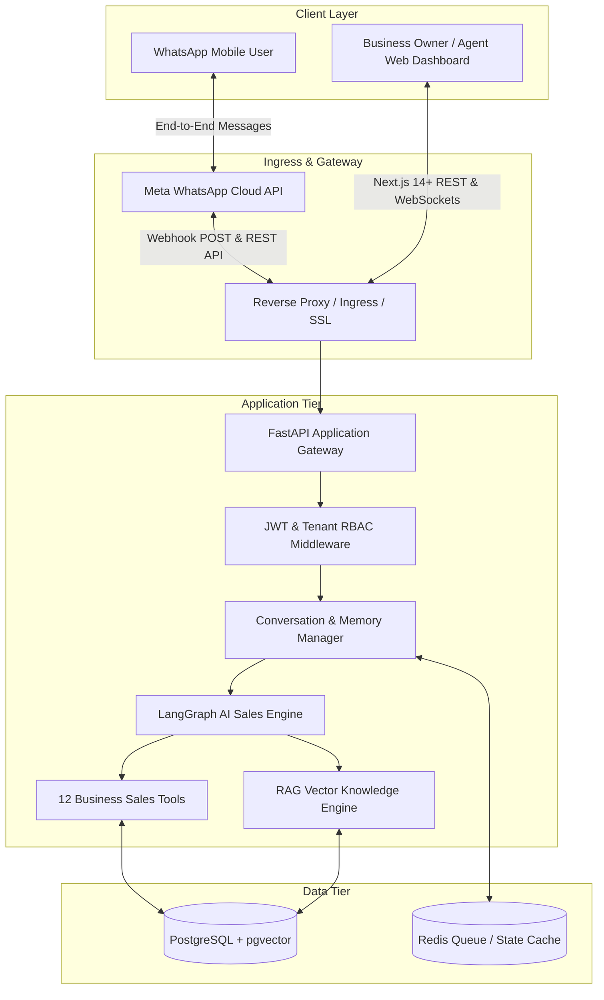

# WhatsApp Sales AI - System Architecture

## 1. Executive Summary

**WhatsApp Sales AI** is a production-grade B2B multi-tenant SaaS platform that turns WhatsApp Business accounts into autonomous, revenue-generating digital sales representatives. Unlike simple rule-based or generic chatbots, WhatsApp Sales AI performs proactive consultative selling, searches real-time product catalogs, verifies variant stock levels, handles objections, prepares customer orders, captures qualified leads, and executes seamless human handoffs.

---

## 2. High-Level Architecture Diagram

---

## 3. Core Architectural Components

### 3.1 Multi-Tenant Isolation
Every request and database query is strictly scoped by `organization_id`. Database entities inherit from a multi-tenant base model ensuring no cross-tenant data leakage.

### 3.2 LangGraph AI Sales Agent Loop
The conversational agent is structured as an orchestrated state graph:
1. **Intent Understanding**: Classifies user query (Product inquiry, stock check, purchase intent, objection, pricing negotiation, support, agent request).
2. **Context Retrieval**: Fetches short-term conversation memory and performs RAG retrieval from business knowledge documents.
3. **Tool Execution**: Dynamically executes business tools (`search_products`, `check_inventory`, `calculate_shipping`, etc.) without granting LLM direct database write access.
4. **Validation & Grounding Guardrail**: Prevents hallucination of prices, stock, delivery times, or store policies.
5. **Response Generation**: Formulates natural, culturally aligned, concise WhatsApp-formatted responses.

### 3.3 Human-in-the-Loop (Handoff State Machine)
Conversations transition through 4 distinct statuses:
- `AI_ACTIVE`: AI handles all incoming customer messages autonomously.
- `HUMAN_REQUIRED`: Escalation triggered (refund request, customer complaint, human requested, or low confidence). Notifications alert staff.
- `HUMAN_ACTIVE`: Live human agent is chatting directly with customer; AI is paused.
- `RESOLVED`: Conversation completed and closed.
