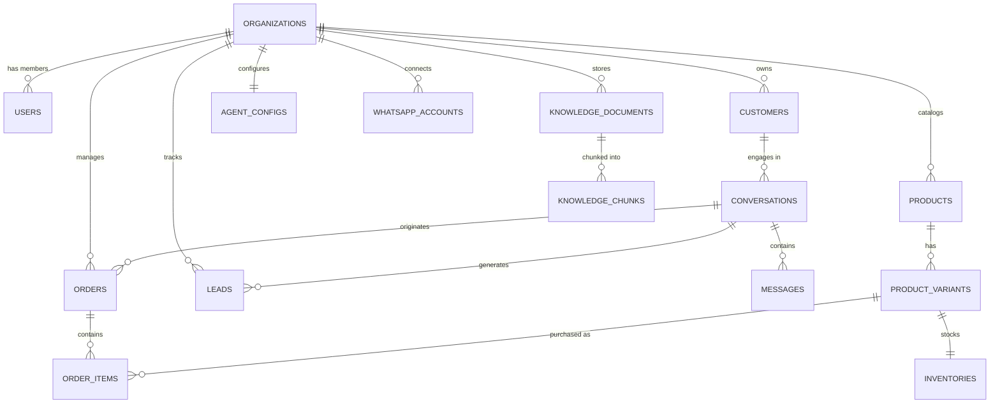

# Database Schema & Data Models

## Overview
The WhatsApp Sales AI database is built on **PostgreSQL 16+** with the **pgvector** extension enabled for semantic similarity embeddings. All business tables incorporate strict multi-tenancy with foreign keys to `organizations(id)`.

---

## 1. Entity Relationship Diagram (ERD)

---

## 2. Core Tables Specification

### 2.1 Multi-Tenant Core
- `organizations`: `id` (UUID), `name`, `slug`, `plan` (Free, Starter, Business, Agency), `is_active`, `created_at`, `updated_at`.
- `users`: `id` (UUID), `email`, `hashed_password`, `full_name`, `avatar_url`, `is_active`, `is_superuser`, `created_at`.
- `memberships`: `id` (UUID), `organization_id` (FK), `user_id` (FK), `role` (`OWNER`, `ADMIN`, `AGENT`, `VIEWER`), `created_at`.

### 2.2 Customer & Conversation
- `customers`: `id` (UUID), `organization_id` (FK), `phone_number` (indexed), `name`, `email`, `address`, `city`, `tags` (JSONB), `metadata` (JSONB), `created_at`.
- `conversations`: `id` (UUID), `organization_id` (FK), `customer_id` (FK), `status` (`AI_ACTIVE`, `HUMAN_REQUIRED`, `HUMAN_ACTIVE`, `RESOLVED`), `buying_stage` (`AWARENESS`, `CONSIDERATION`, `DECISION`, `RETENTION`), `current_intent`, `cart_state` (JSONB), `summary`, `last_message_at`, `created_at`.
- `messages`: `id` (UUID), `conversation_id` (FK), `organization_id` (FK), `sender_type` (`CUSTOMER`, `AI`, `HUMAN_AGENT`, `SYSTEM`), `content`, `tool_calls` (JSONB), `tool_results` (JSONB), `whatsapp_message_id` (unique index), `status` (`SENT`, `DELIVERED`, `READ`, `FAILED`), `created_at`.

### 2.3 Catalog & Inventory
- `products`: `id` (UUID), `organization_id` (FK), `name`, `sku` (unique per org), `description`, `category`, `price` (Numeric), `discount_price` (Numeric), `is_available`, `tags` (ARRAY/JSONB), `images` (JSONB), `created_at`.
- `product_variants`: `id` (UUID), `product_id` (FK), `organization_id` (FK), `sku`, `title`, `size`, `color`, `material`, `price_override`, `stock_quantity`, `created_at`.

### 2.4 Orders & Fulfillment
- `orders`: `id` (UUID), `organization_id` (FK), `conversation_id` (FK nullable), `customer_id` (FK), `order_number` (e.g. `ORD-2026-0001`), `status` (`PENDING`, `CONFIRMED`, `PROCESSING`, `SHIPPED`, `DELIVERED`, `CANCELLED`), `subtotal`, `shipping_fee`, `discount`, `total_amount`, `payment_method` (`COD`, `BKASH`, `CARD`, `ONLINE`), `payment_status` (`UNPAID`, `PAID`, `REFUNDED`), `delivery_address`, `city`, `tracking_number`, `notes`, `created_at`.
- `order_items`: `id` (UUID), `order_id` (FK), `product_variant_id` (FK), `product_name`, `variant_name`, `unit_price`, `quantity`, `total_price`.

### 2.5 Leads & CRM
- `leads`: `id` (UUID), `organization_id` (FK), `customer_id` (FK), `conversation_id` (FK), `name`, `phone`, `intent`, `interested_products` (JSONB), `budget` (Numeric), `location`, `lead_score` (Integer 0-100), `status` (`NEW`, `CONTACTED`, `QUALIFIED`, `CONVERTED`, `LOST`), `created_at`.

### 2.6 RAG Knowledge Base
- `knowledge_documents`: `id` (UUID), `organization_id` (FK), `title`, `document_type` (`POLICY`, `FAQ`, `MANUAL`, `GENERAL`), `source_url`, `total_chunks`, `status` (`PENDING`, `INDEXED`, `FAILED`), `created_at`.
- `knowledge_chunks`: `id` (UUID), `document_id` (FK), `organization_id` (FK), `chunk_index`, `content`, `embedding` (`vector(1536)`), `metadata` (JSONB), `created_at`.

### 2.7 AI Configuration & WhatsApp
- `agent_configs`: `id` (UUID), `organization_id` (FK unique), `agent_name`, `tone`, `language`, `persona_prompt`, `greeting_message`, `business_hours` (JSONB), `enabled_tools` (JSONB), `handoff_triggers` (JSONB), `sales_rules` (JSONB).
- `whatsapp_accounts`: `id` (UUID), `organization_id` (FK), `phone_number_id`, `waba_id`, `display_phone_number`, `access_token` (encrypted), `webhook_verify_token`, `status` (`CONNECTED`, `DISCONNECTED`, `PENDING_VERIFICATION`).
- `audit_logs`: `id` (UUID), `organization_id` (FK), `actor_type`, `actor_id`, `action`, `entity_type`, `entity_id`, `details` (JSONB), `created_at`.
