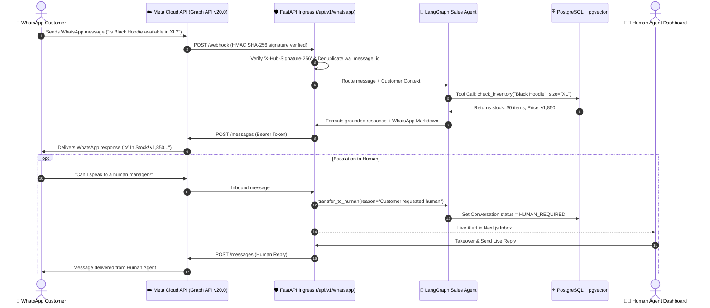

# WhatsApp Cloud API Master Integration Guide

This guide provides a production-grade, step-by-step walkthrough for integrating **WhatsApp Sales AI** with the official **Meta WhatsApp Cloud API (Graph API v20.0+)**, configuring webhooks, generating permanent access tokens, testing locally with tunneling tools, and deploying to live customers.

---

## 1. Integration Architecture Overview



---

## 2. Step-by-Step Meta Developer Setup

### Step 1: Create Meta Developer Account & Business App
1. Go to the [Meta for Developers Portal](https://developers.facebook.com/).
2. Log in with your Facebook account and click **My Apps** > **Create App**.
3. Select **Other** as the use case, click **Next**, then choose **Business** as the app type.
4. Provide an **App Name** (e.g., `WhatsApp Sales AI Engine`) and link your **Meta Business Account**.
5. Click **Create App**.

---

### Step 2: Add WhatsApp Product to Your Meta App
1. In the App Dashboard, locate **WhatsApp** in the "Add products to your app" section.
2. Click **Set Up**.
3. You will be redirected to the **WhatsApp > API Setup** dashboard.
4. Meta provides a temporary test phone number, a temporary 24-hour access token, and a **Phone Number ID** + **WhatsApp Business Account ID (WABA ID)**.

> [!NOTE]
> Save the **Phone Number ID** and **WABA ID**—you will input these directly into the WhatsApp Sales AI dashboard.

---

### Step 3: Generate a Permanent System User Access Token

Temporary tokens expire after 24 hours. For commercial 24/7 SaaS production, you **MUST** create a System User token that never expires:

1. Go to [Meta Business Suite > Business Settings](https://business.facebook.com/settings/).
2. Under **Users**, click **System Users**.
3. Click **Add** > Enter a Name (e.g., `SalesAI-SystemUser`) > Select Role: **Admin** > Click **Create System User**.
4. In the System User detail page, click **Add Assets**:
   - Select **Apps** > Select your Meta App > Enable **Full Control (Manage App)**.
   - Select **WhatsApp Accounts** > Select your WABA > Enable **Full Control (Manage WhatsApp Business Account)**.
   - Click **Save Changes**.
5. Click **Generate New Token**:
   - Select your App from the dropdown.
   - Set **Token Expiration**: `Never`.
   - Select the following required permissions:
     - `whatsapp_business_messaging` (Required to send/receive messages)
     - `whatsapp_business_management` (Required to manage templates and account settings)
6. Click **Generate Token**.
7. **Copy and safely store the generated 200+ character token.**

---

## 3. Webhook Configuration & Handshake

Meta sends incoming messages and delivery receipts to your server via HTTP Webhooks.

### Webhook Endpoints in WhatsApp Sales AI:
- **Verification URL (GET)**: `https://your-domain.com/api/v1/whatsapp/webhook`
- **Event Receiver (POST)**: `https://your-domain.com/api/v1/whatsapp/webhook`
- **Default Verify Token**: `sales_ai_webhook_verify_secret` (or customized in `.env` / Settings)

### Step 1: Configure Webhook in Meta Developer Portal
1. In the Meta App Dashboard, navigate to **WhatsApp** > **Configuration**.
2. Under **Webhook**, click **Edit**.
3. Enter:
   - **Callback URL**: `https://your-domain.com/api/v1/whatsapp/webhook`
   - **Verify Token**: `sales_ai_webhook_verify_secret`
4. Click **Verify and Save**. Meta will send a `GET` request with challenge parameters; WhatsApp Sales AI validates the verify token and returns the challenge string with HTTP 200.
5. Under **Webhook fields**, click **Manage** and subscribe to:
   - `messages` (Mandatory - receives customer incoming text, interactive clicks, media)
   - `message_deliveries` (Optional - delivery receipts)
   - `message_reads` (Optional - read status)

---

## 4. Testing Webhooks Locally (Ngrok & Cloudflare)

To test webhooks on your local computer (`localhost:8000`), expose your local port with a secure tunnel:

### Option A: Using Ngrok
```bash
# 1. Start your local backend on port 8000
uvicorn app.main:app --reload --port 8000

# 2. In a separate terminal, expose port 8000 with ngrok
ngrok http 8000
```
- Ngrok will output a public HTTPS URL: `https://a1b2-c3d4.ngrok-free.app`
- Set your Meta Webhook URL to:
  `https://a1b2-c3d4.ngrok-free.app/api/v1/whatsapp/webhook`

### Option B: Using Cloudflare Tunnel (Free & No Account Required)
```bash
cloudflared tunnel --url http://localhost:8000
```
- Use the generated `.trycloudflare.com` URL in your Meta Webhook setup.

---

## 5. Security & HMAC-SHA256 Signature Verification

Every incoming webhook request from Meta includes a cryptographic signature in the HTTP header:
```http
X-Hub-Signature-256: sha256=d3b07384d113edec49eaa6238ad5ff00...
```

WhatsApp Sales AI automatically verifies this signature against your `WHATSAPP_APP_SECRET`:

```python
def verify_whatsapp_signature(payload_bytes: bytes, signature_header: str, app_secret: str) -> bool:
    if not signature_header or not signature_header.startswith("sha256="):
        return False
    expected_hash = signature_header.split("=")[1]
    calculated_hash = hmac.new(
        key=app_secret.encode("utf-8"),
        msg=payload_bytes,
        digestmod=hashlib.sha256
    ).hexdigest()
    return hmac.compare_digest(calculated_hash, expected_hash)
```

> [!SECURITY]
> Any request with an invalid or spoofed signature is rejected immediately with **HTTP 403 Forbidden**.

---

## 6. Supported WhatsApp Message Types

WhatsApp Sales AI formats responses tailored for WhatsApp mobile viewing:

### 1. Standard Rich Text with WhatsApp Formatting
```json
{
  "messaging_product": "whatsapp",
  "recipient_type": "individual",
  "to": "8801711223344",
  "type": "text",
  "text": {
    "preview_url": true,
    "body": "🛍️ *Heavyweight Black Hoodie*\n💰 Price: ৳1,850 *(Discounted!)*\n\n✅ *IN STOCK* in size *XL* (30 remaining).\n\nWould you like me to place the order?"
  }
}
```

### 2. Interactive Quick Reply Buttons (Max 3 Buttons)
```json
{
  "messaging_product": "whatsapp",
  "recipient_type": "individual",
  "to": "8801711223344",
  "type": "interactive",
  "interactive": {
    "type": "button",
    "body": {
      "text": "Please confirm your order for ৳1,860 via Cash on Delivery."
    },
    "action": {
      "buttons": [
        {"type": "reply", "reply": {"id": "btn_confirm", "title": "✅ Confirm Order"}},
        {"type": "reply", "reply": {"id": "btn_modify", "title": "✏️ Change Address"}},
        {"type": "reply", "reply": {"id": "btn_human", "title": "👤 Talk to Agent"}}
      ]
    }
  }
}
```

### 3. Approved Notification Templates
```json
{
  "messaging_product": "whatsapp",
  "to": "8801711223344",
  "type": "template",
  "template": {
    "name": "order_shipped_notification",
    "language": {"code": "en"},
    "components": [
      {
        "type": "body",
        "parameters": [
          {"type": "text", "text": "Tariq"},
          {"type": "text", "text": "ORD-2026-9281"},
          {"type": "text", "text": "Steadfast Courier (TRK-98231)"}
        ]
      }
    ]
  }
}
```

---

## 7. 24-Hour Customer Service Window & Template Rules

Meta enforces a **24-hour customer service messaging window**:
1. **User-Initiated Conversation**: When a customer sends a WhatsApp message, a 24-hour standard messaging window opens. The AI Sales Agent can freely send dynamic text, interactive buttons, and product recommendations at **no additional template cost**.
2. **Outside the 24-Hour Window**: If 24 hours have elapsed since the customer's last message, you **cannot** send free-form text. You must send a pre-approved **Meta Message Template** (e.g. shipping updates, re-engagement offers).

---

## 8. In-Browser Live Simulator (Zero-Cost Testing)

WhatsApp Sales AI includes an interactive in-browser WhatsApp phone simulator:

1. Click **Open WhatsApp Simulator** in the top navigation bar.
2. Enter any test phone number and customer name.
3. Test realistic conversation scenarios:
   - Budget inquiry: *"I need a gift for my wife under 3000 taka"*
   - Stock check: *"Is the black hoodie available in XL?"*
   - Order placement: *"Deliver to House 12, Road 4, Dhanmondi, Dhaka"*
   - Confirmation: *"Yes, please confirm the order"*
   - Human escalation: *"I want to speak with a manager"*
4. Watch tool calling pills execute in real-time and verify instant database updates!

---

## 9. Production Readiness & Messaging Tier Scaling

When launching to public customers:

| Phase | Requirement | Messaging Tier Limit |
|---|---|---|
| **Tier 1 (Sandbox)** | Unverified Business / Test Numbers | 250 unique contacts / 24 hrs |
| **Tier 2 (Standard)** | Complete Meta Business Verification | 1,000 unique contacts / 24 hrs |
| **Tier 3 (Growth)** | High message quality score over 7 days | 10,000 unique contacts / 24 hrs |
| **Tier 4 (Enterprise)** | Maintained quality at scale | 100,000+ unique contacts / 24 hrs |

### Pre-Launch Checklist:
- [ ] Connect official registered business phone number in Meta Business Manager.
- [ ] Complete **Business Verification** (Trade License / Tax Document).
- [ ] Submit Official WhatsApp **Display Name** for Meta review.
- [ ] Set 6-digit Two-Factor Authentication (2FA) PIN for the phone number.
- [ ] Generate a Permanent System User Token with `whatsapp_business_messaging`.
- [ ] Enter credentials into WhatsApp Sales AI `/whatsapp` settings page.

---

## 10. Troubleshooting & Error Codes Matrix

| Error Code | Meaning | Resolution |
|---|---|---|
| `131030` | *Recipient phone number not allowed in sandbox* | In sandbox mode, add the recipient phone number to the allowed numbers list in Meta API Setup, or verify your business for unrestricted live messaging. |
| `131047` | *Re-engagement message outside 24h window* | The 24-hour customer window expired. Send an approved Meta message template instead of free-form text. |
| `190` | *Access token expired / invalid* | The 24-hour temporary token expired. Follow Section 2, Step 3 to generate a Permanent System User Token with `Never` expire. |
| `403 Forbidden` | *Webhook verification failed* | Ensure `hub.verify_token` matches `WHATSAPP_DEFAULT_VERIFY_TOKEN` (default: `sales_ai_webhook_verify_secret`). |
| `X-Hub-Signature` Mismatch | *HMAC Signature validation error* | Ensure `WHATSAPP_APP_SECRET` in your `.env` matches your Meta App Secret found in **App Settings > Basic**. |
